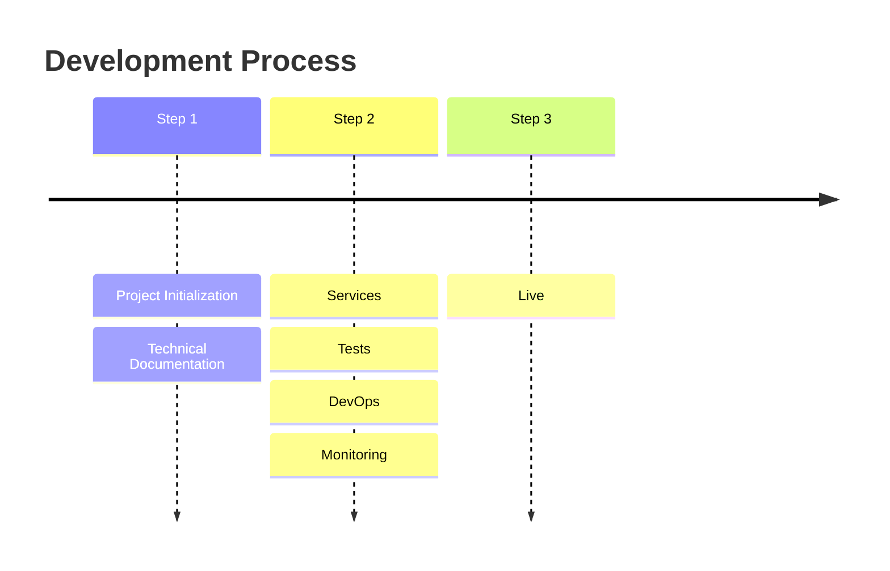

# Overview
This project aims to put all my development knowledge into one project. 
You can learn more details about the project in the following sections.

# Milestone

# Services Index
- [Services](services/index.md)
    1. [Clickstream](services/clickstream.md)
    2. [Backend](services/backend/index.md)
        1. [Customer](services/backend/customer/index.md)
            1. [Authorization](services/backend/customer/authorization.md)
            2. [Catalog](services/backend/customer/catalog.md)
            3. [Search](services/backend/customer/search.md)
            4. [Recommendation](services/backend/customer/recommendation.md)
        2. [Merchant](services/backend/merchant/index.md)
            1. [Authorization](services/backend/merchant/authorization.md)
            2. [Inventory](services/backend/merchant/inventory.md)

