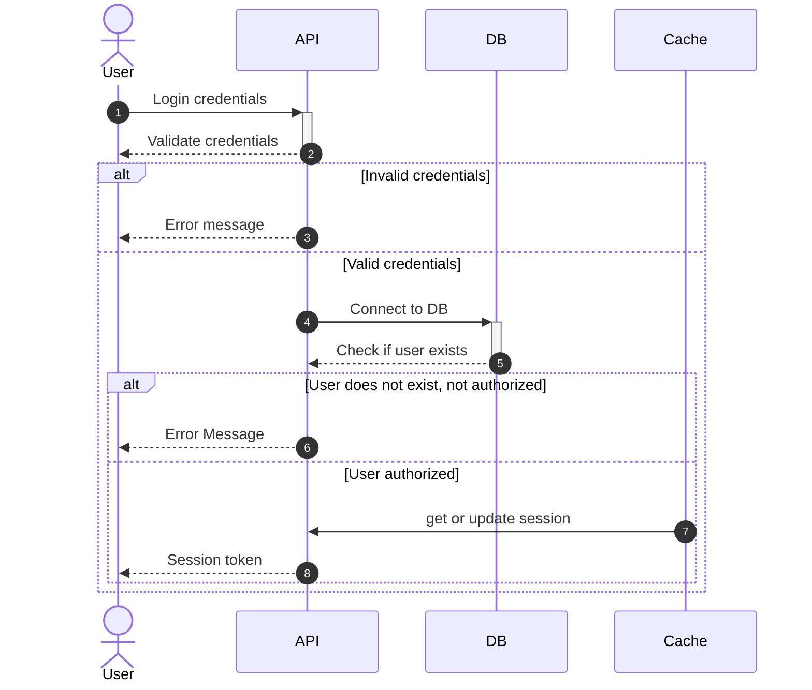

# Authorization
The Authorization service validates the given users' credentials, stores
session information on `Session` ***(in memory cache)*** if credentials are 
valid, and then returns a `token` to the users. Otherwise, returns error message.

# Used Technologies
| Tecnology             | Purpose                                                |
| --------------------- | ------------------------------------------------------ |
| ```Scala```           | It serves users' requests and performs business logic. |
| ```CouchDB```         | It stores users' login informations.                   |
| ```Redis```           | It stores users' session informations on memory.       | 

# Architecture



