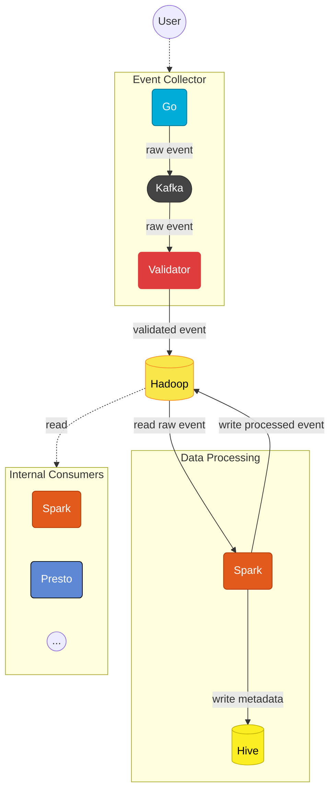

<p>
    <a href="/docs/index.md">Home</a> /
    <a href="/docs/services/index.md">Services</a> /
    <span>Clickstream</span>
</p>

# Overview
The **Clickstream** service will collect user events and store the raw data on the 
```Apache Hadoop``` cluster, and **internal consumers** can access the cluster via
```Apache Spark```, ```Presto``` etc. to read processed data in order to use
it in their business logic.

# Purpose of Service
We are collecting user events for the reasons listed below:

1. Recommend better **product** or **content** to users based on their 
historical behaviour.
2. Creating **advertising campaigns** based on users' behaviour.
3. Understand how **different page layouts** or **contents** affect users'
behaviour.

# Architecture


# Components
[🔗 Documentation of Clickstream Components](/services/clickstream/docs/index.md)
