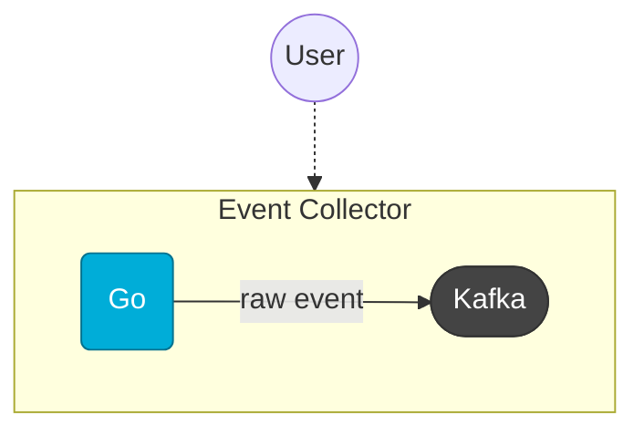

##### [Home](/docs/index.md)/[Services](/docs/services/index.md)/[Clickstream](/docs/services/clickstream/index.md)/[Components](/services/clickstream/docs/index.md)/Collector
##### [Changelog](/services/clickstream/collector/CHANGELOG/README.md)

# Overview
The `Collector`, collects the `raw event(s)` data from the source and sends it
into the specified `Kafka` topic. The Collector contains an HTTP server. 
The HTTP server provides [endpoints](#endpoints) in order to collects event(s).

# Architecture

> [Diagram Reference](/docs/services/clickstream/index.md#architecture)


# Endpoints
```http
POST /e HTTP/1.1
Accept: application/json
Content-Length: 48
Content-Type: application/json

{
    "tv001": "111",
    "tv002": "123",
    "tv003": "web"
}


HTTP/1.1 200 OK
Content-Length: 0
Date: Thu, 03 Oct 2024 13:56:10 GMT
```
---

```http
GET /pixel?tv001=111&tv002=123&tv003=mobile HTTP/1.1
Accept: */*

HTTP/1.1 200 OK
Content-Length: 42
Content-Type: image/gif
Date: Thu, 03 Oct 2024 13:56:42 GMT
```

## Notes
In principle, events are sent by means of `Beacon API`. But some clients don't
support that. Therefore, we should use the `/pixel` endpoint in that case. the `/pixel`
sends the event data within its query and returns a `1px` image as response.

Both endpoint responses are returns `200 OK` because we won't show an error
on the client side or resend the event. We always assume that the events which we sent,
are always arrived to the Collector.

As follows, there are some examples of how we can use these endpoints:

```js
// With Beacon API
navigator.sendBeacon(<COLLECTOR_ORIGIN>, <EVENT_DATA>);

// Without Beacon API
var img = document.createElement("img");
img.src = <COLLECTOR_ORIGIN_WITH_QUERY>
img.style.display = "none";
document.body.appendChild(img);
img.onload = function() {
    img.remove();
};
```

Eventually, it's up to you that how to use these endpoints in your project.
