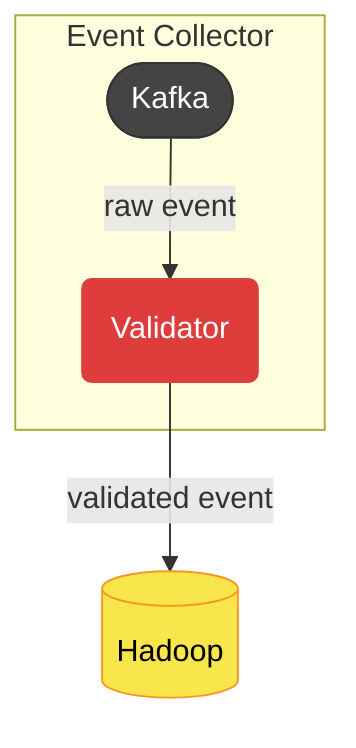

    <a href="/docs/index.md">Home</a> /
    <a href="/docs/services/index.md">Services</a> /
    <a href="/docs/services/clickstream/index.md">Clickstream</a> /
    <a href="/services/clickstream/docs/index.md">Components</a> /
    Validator

# Overview
The `Validator` is a Spark streaming job in order to validate events.

# Architecture

> [Diagram Reference](/docs/services/clickstream/index.md#architecture)

# Changelogs
- [v0.1.0-alpha.1 - 23/10/2024](/services/clickstream/src/validator/CHANGELOG.md#v010-alpha1---23102024)
